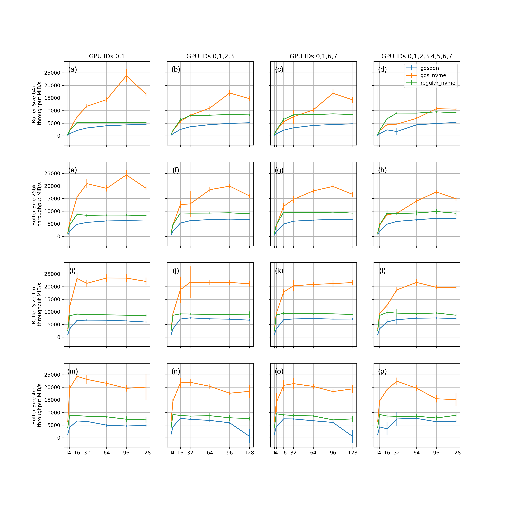
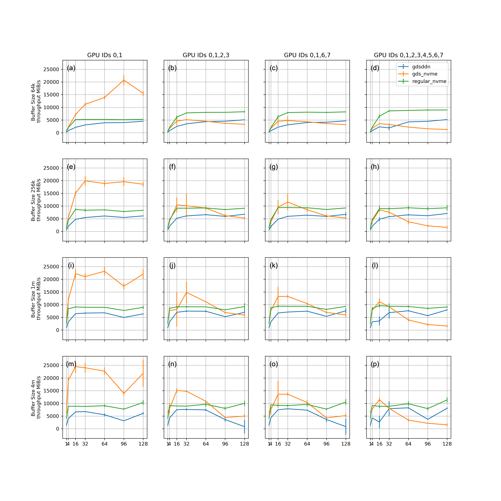
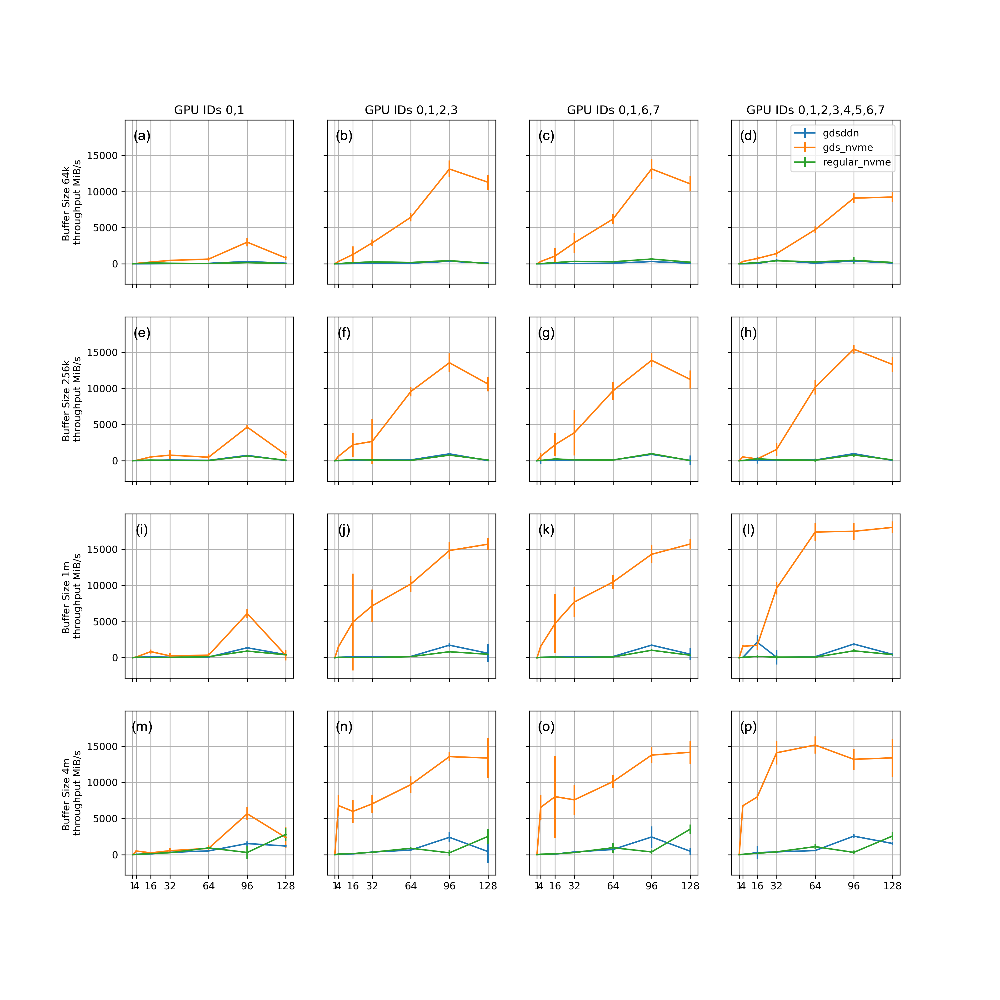

# Benchmark GPUDirectStorage (GDS)


## System Info

NVIDIA DGX A100 paired with DDN AX400. Similar, if not the same, to [SELENE](https://www.top500.org/system/179842/)

* CPU: 2 x AMD EPYC 7742 64-Core Processor
* GPU: 8 x [A100](https://www.nvidia.com/content/dam/en-zz/Solutions/Data-Center/nvidia-ampere-architecture-whitepaper.pdf)
* Local Storage: 4-way raid0 nvme
* Remote Storage: DDN AX400

See details about the system in `./sys_info`.

## Elbencho Read Test

[Elbencho](https://github.com/breuner/elbencho) is an open-sourced distributed
storage benchmark tool that supports GDS.

Read test covers the cartesian product of the following 4 categories. Each
configuration has 10 runs, resulting 3360 runs in total.


| settings                 | values                             |
|--------------------------|------------------------------------|
| Storage                  | "gdsddn", "gdsnvme", "nvme"        |
| GPU IDs                  | "0,1", "0,1,2,3", "0,1,6,7", "0-7" |
| buffer size `-b`         | 64KiB, 256KiB, 1MiB, 4MiB          |
| number of workers `-t`   | 1,4,16,32,64,96,128                |

| Storage Settings         | elbencho flags                                |
|--------------------------|-----------------------------------------------|
| gdsddn                   | `--gdsbufreg --cufile --direct /remote/file/` |
| gdsnvme                  | `--gdsbufreg --cufile --direct /local/nvme`   |
| nvme                     | `--direct /local/nvme`                        |

See details on how these experiments were conducted in `benchmark.sh`.

### Results (Throughput MiB/s)

Elbencho reports throughput of the first finished worker and the last finished worker.
The values are medians of the 10 runs, and error bars the standard deviation.

#### First



#### Last


#### Diff



See details on how these figures created from the results in `analyze_gds.ipynb`.

## Write a test file [TODO]

```
# write to 4-way raid0 nvme
./elbencho -w -b 1m --direct --size 1g /raid/data/yren/test_file
# write to ddn lustre
./elbencho -w -b 1m --direct --size 1g /lustre/cheetah/data/yren/test_file
```

